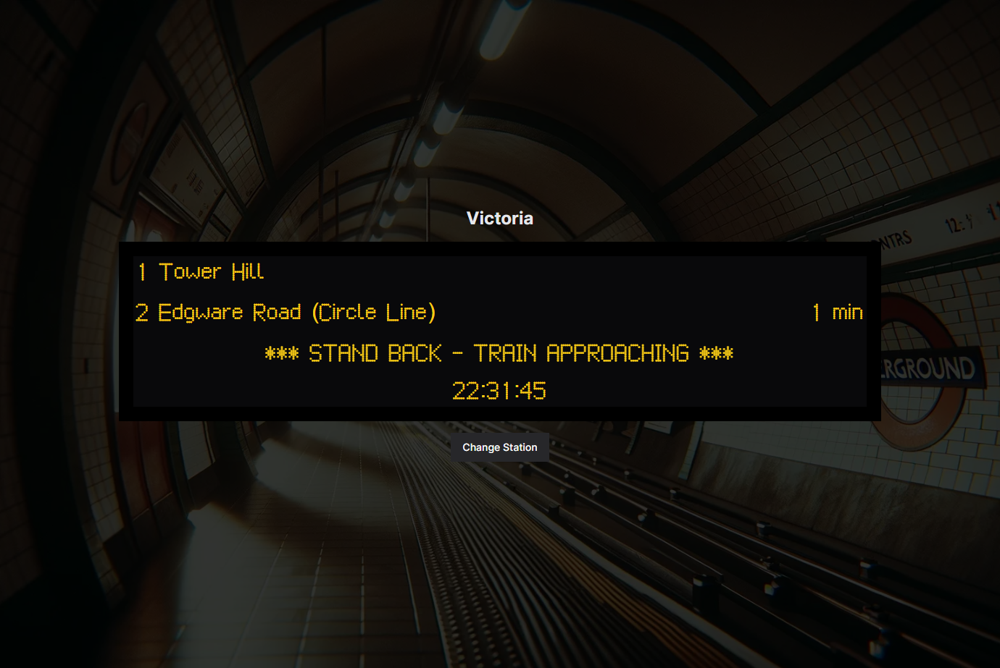

<div id="top"></div>

<!-- PROJECT LOGO -->
<br />
<div align="center">
<h3 align="center">TFL Board</h3>

  <p align="center">
    Recreating the departure boards for the London Underground.
    <br />
    <a href="https://tfl-board.vercel.app/">View Site</a>
  </p>
</div>

<!-- ABOUT THE PROJECT -->
<div align="center">
 
</div>

## About The Project

I created this to play around with Redux Query for fetching the data, and learn that for a work project.

I wanted to test RTK Query's ability to generate hooks based on an openApi schema.

Room for future improvements with handling the errors from RTK but a good intro into what was on offer with automated refetching and polling.

Possible future work:

- Add debounce to station search (easy)
- Utilize RTK Mutations for the incoming data
- Fix timezone issues (easy)

<p align="right">(<a href="#top">back to top</a>)</p>

### Built With

- [![Next][next.js]][next-url]
- [![Typescript][typescript-badge]][typescript-url]
- [![Tailwind][tailwind-badge]][tailwind-url]
- [RTK Query](https://redux-toolkit.js.org/rtk-query/overview)

<p align="right">(<a href="#top">back to top</a>)</p>

<!-- GETTING STARTED -->

## Getting Started

To get a local copy up and running follow these simple example steps.

### Installation

1. Clone the repo
   ```sh
   git clone https://github.com/jolbol1/jolbol1.github.io.git
   ```
2. Install NPM packages
   ```sh
   pnpm install
   ```
3. Spin it up!
   ```sh
   pnpm run dev
   ```

<p align="right">(<a href="#top">back to top</a>)</p>

<!-- LICENSE -->

## License

Distributed under the MIT License. See `LICENSE.txt` for more information.

<p align="right">(<a href="#top">back to top</a>)</p>

<!-- CONTACT -->

## Contact

Your Name - [@JollyShopland](https://twitter.com/JollyShopland) - github@jamesshopland.com

Project Link: [https://github.com/jolbol1/tfl-board](https://github.com/jolbol1/jolbol1.github.io)

<p align="right">(<a href="#top">back to top</a>)</p>

<!-- MARKDOWN LINKS & IMAGES -->
<!-- https://www.markdownguide.org/basic-syntax/#reference-style-links -->

[license-shield]: https://img.shields.io/github/license/jolbol1/jolbol1.github.io.svg?style=for-the-badge
[license-url]: https://github.com/jolbol1/jolbol1.github.io/blob/master/LICENSE.txt
[linkedin-shield]: https://img.shields.io/badge/-LinkedIn-black.svg?style=for-the-badge&logo=linkedin&colorB=555
[linkedin-url]: https://linkedin.com/in/james.shopland
[product-screenshot]: images/screenshot.png
[next.js]: https://img.shields.io/badge/next.js-000000?style=for-the-badge&logo=nextdotjs&logoColor=white
[next-url]: https://nextjs.org/
[react.js]: https://img.shields.io/badge/React-20232A?style=for-the-badge&logo=react&logoColor=61DAFB
[react-url]: https://reactjs.org/
[vue.js]: https://img.shields.io/badge/Vue.js-35495E?style=for-the-badge&logo=vuedotjs&logoColor=4FC08D
[vue-url]: https://vuejs.org/
[angular.io]: https://img.shields.io/badge/Angular-DD0031?style=for-the-badge&logo=angular&logoColor=white
[angular-url]: https://angular.io/
[svelte.dev]: https://img.shields.io/badge/Svelte-4A4A55?style=for-the-badge&logo=svelte&logoColor=FF3E00
[svelte-url]: https://svelte.dev/
[laravel.com]: https://img.shields.io/badge/Laravel-FF2D20?style=for-the-badge&logo=laravel&logoColor=white
[laravel-url]: https://laravel.com
[bootstrap.com]: https://img.shields.io/badge/Bootstrap-563D7C?style=for-the-badge&logo=bootstrap&logoColor=white
[bootstrap-url]: https://getbootstrap.com
[jquery.com]: https://img.shields.io/badge/jQuery-0769AD?style=for-the-badge&logo=jquery&logoColor=white
[jquery-url]: https://jquery.com
[gatsby-badge]: https://img.shields.io/badge/Gatsby-%23663399.svg?style=for-the-badge&logo=gatsby&logoColor=white
[gatsby]: https://www.gatsbyjs.com/
[typescript-badge]: https://img.shields.io/badge/typescript-%23007ACC.svg?style=for-the-badge&logo=typescript&logoColor=white
[typescript-url]: https://www.typescriptlang.org/
[tailwind-badge]: https://img.shields.io/badge/tailwindcss-%2338B2AC.svg?style=for-the-badge&logo=tailwind-css&logoColor=white
[tailwind-url]: https://tailwindcss.com/
[svelte-badge]: https://img.shields.io/badge/svelte-%23f1413d.svg?style=for-the-badge&logo=svelte&logoColor=white
[svelte-url]: https://svelte.dev/
[vite-badge]: https://img.shields.io/badge/vite-%23646CFF.svg?style=for-the-badge&logo=vite&logoColor=white
[vite-url]: https://vitejs.dev/
[vercel-badge]: https://img.shields.io/github/deployments/jolbol1/JamesShopland.com/production?label=Vercel&logo=vercel&style=for-the-badge
